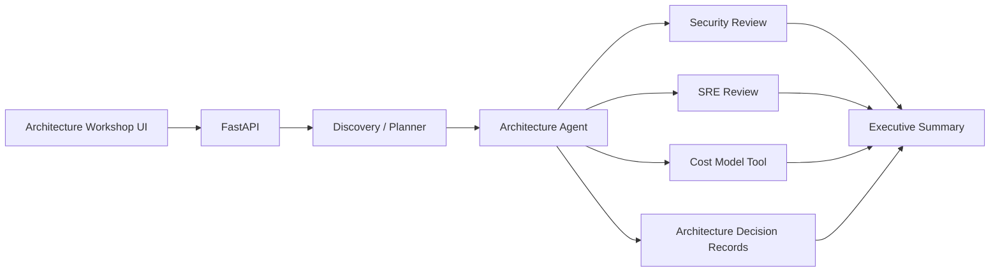

# AI Solution Architect — Agentic Architecture Workshop

A local-first AI architecture workshop that transforms a customer problem statement into a structured solution proposal covering application architecture, security, SRE, implementation planning, cost analysis, and stakeholder communication.

The project demonstrates how agentic AI workflows can support solution-architecture activities while keeping the workflow structured, inspectable, and reproducible.

> **Portfolio scope:** This project demonstrates agent orchestration and solution-design patterns. It does not claim deployment on proprietary cloud infrastructure.

## What It Demonstrates

* Multi-stage agent and workflow orchestration
* Requirements discovery and constraint extraction
* Application architecture generation
* Dedicated security and SRE analysis
* Architecture Decision Records (ADRs)
* Trust boundaries and data-classification concepts
* Least-privilege security reasoning
* Deterministic cost-model calculations
* Structured outputs and validation
* Local document and tool usage
* Local LLM inference through Ollama
* Cloud-neutral architecture patterns
* Mock mode for reproducible execution
* Interactive architecture-workshop UI

## Architecture



The workflow separates major solution-design responsibilities instead of relying on a single unconstrained agent.

This makes individual stages easier to inspect, test, evaluate, and improve.

## Workflow

```text
Customer Problem
       |
       v
Requirements Discovery
       |
       v
Architecture Proposal
       |
       +---------> Security Review
       |
       +---------> SRE Review
       |
       +---------> Cost Model
       |
       +---------> Architecture Decision Records
       |
       v
Executive / Stakeholder Summary
```

### Requirements Discovery

The workflow starts by identifying the customer problem, requirements, constraints, assumptions, and relevant architectural considerations.

### Architecture Design

The architecture stage converts the discovered requirements into a structured solution proposal covering application components, integrations, data flow, and system boundaries.

### Security Review

The security stage considers areas such as:

* Trust boundaries
* Data classification
* Access control
* Least privilege
* Sensitive-data handling
* Security constraints

### SRE Review

The SRE stage focuses on operational considerations such as:

* Reliability
* Observability
* Scalability
* Availability
* Failure handling
* Operational requirements

### Cost Model

Cost calculations are handled through deterministic tooling rather than asking the LLM to generate numerical estimates.

This provides a more reproducible approach for scenario-based architecture discussions.

### Architecture Decision Records

Important architectural decisions are captured as ADR-style outputs so that decisions, assumptions, and trade-offs remain visible to technical stakeholders.

### Executive Summary

The final stage converts the technical analysis into a concise stakeholder-oriented summary suitable for architecture discussions and presentations.

## Customer-Facing AI Engineering

Solution architecture requires more than generating a technically plausible response.

A customer-facing AI engineering workflow needs to translate ambiguous requirements into:

* Explicit assumptions
* Architectural constraints
* System boundaries
* Security requirements
* Operational requirements
* Cost considerations
* Implementation priorities
* Stakeholder-facing communication

This project makes those steps explicit through a structured agent workflow.

## Tech Stack

* Python
* FastAPI
* Pydantic
* Agent/workflow orchestration
* Local LLM inference
* Ollama
* Deterministic cost-model tooling
* Mermaid
* HTML/CSS/JavaScript
* Pytest

## Running Locally

### 1. Create a virtual environment

```bash
python -m venv .venv
```

### 2. Activate the environment

**Windows:**

```bash
.venv\Scripts\activate
```

**Linux/macOS:**

```bash
source .venv/bin/activate
```

### 3. Install dependencies

```bash
pip install -r requirements.txt
```

### 4. Start in mock mode

Mock mode allows the application to run without an external LLM service.

**Windows Command Prompt:**

```bash
set LLM_MODE=mock
```

**PowerShell:**

```powershell
$env:LLM_MODE="mock"
```

**Linux/macOS:**

```bash
export LLM_MODE=mock
```

### 5. Start the application

```bash
uvicorn app.main:app --reload
```

Open the application at:

```text
http://127.0.0.1:8000
```

FastAPI documentation:

```text
http://127.0.0.1:8000/docs
```

## Optional Local LLM

The project can optionally use Ollama for local model inference.

This provides a local execution path without requiring a paid cloud AI API.

The exact model configuration depends on the model available in the local Ollama installation.

Mock mode remains available for reproducible development and testing.

## Demo Flow

1. Enter a customer problem statement and constraints.
2. Run the requirements-discovery stage.
3. Review extracted assumptions and requirements.
4. Generate the architecture proposal.
5. Review security considerations.
6. Review SRE and operational considerations.
7. Inspect the deterministic cost-model output.
8. Review Architecture Decision Records.
9. Generate the stakeholder summary.

## Testing

Run the automated test suite:

```bash
python -m pytest -q
```

The test suite provides reproducible validation of core application behavior.

## Evaluation

The architecture workflow can be evaluated using dimensions such as:

* Requirements coverage
* Constraint adherence
* Security-control completeness
* Consistency between architecture sections
* Cost-model consistency
* Quality of generated ADRs
* Stakeholder-summary usefulness

These dimensions provide a foundation for future evaluation datasets and automated benchmarking.

## Design Trade-offs

| Decision                          | Rationale                                                                               |
| --------------------------------- | --------------------------------------------------------------------------------------- |
| Explicit workflow stages          | Easier to inspect and evaluate than unconstrained agent loops                           |
| Separate security and SRE reviews | Makes non-functional requirements explicit and reviewable                               |
| Deterministic cost tool           | Reduces the risk of fabricated numerical reasoning                                      |
| Cloud-neutral components          | Demonstrates transferable architecture knowledge without requiring a paid cloud account |
| Mock mode                         | Enables reproducible local demos and test execution                                     |
| Structured outputs                | Makes generated architecture artifacts easier to validate and consume                   |

## Engineering Focus

The project focuses on solution architecture rather than simply generating an AI response.

Key engineering concerns include:

* Requirements analysis
* Architecture decomposition
* Agent workflow design
* Security and trust boundaries
* Least-privilege design
* Reliability and observability
* Cost estimation
* Architecture decision tracking
* Structured AI outputs
* Stakeholder communication
* Reproducible local execution

## Project Scope and Limitations

This is a portfolio project designed to demonstrate AI engineering and solution-architecture patterns.

It does not claim:

* Production deployment
* Proprietary cloud infrastructure
* Production-grade security certification
* Real customer data
* Production cost estimates
* Production SLA guarantees

A production deployment would require additional infrastructure, identity and access management, security controls, observability, testing, governance, and operational processes.

## Future Improvements

* Add architecture evaluation benchmarks
* Add OpenTelemetry tracing
* Add persistent workshop/project history
* Add vector search for architecture references
* Add cloud-specific architecture adapters
* Add infrastructure-as-code generation
* Add human approval checkpoints
* Add automated architecture validation rules
* Add architecture comparison and versioning
* Add evaluation datasets for different customer scenarios
