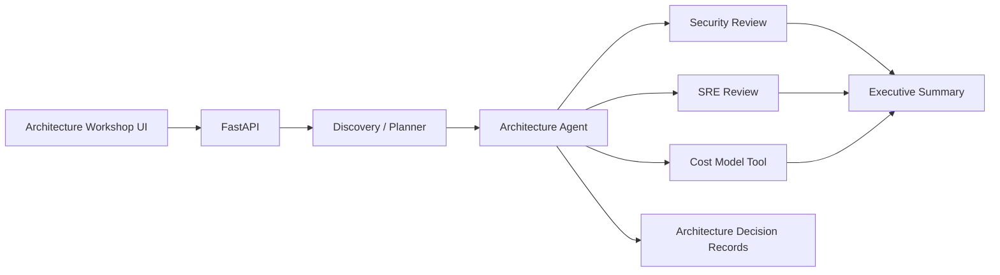

# AI Solution Architect — Agentic Architecture Workshop

A local-first architecture workshop that converts a customer problem statement into a structured proposal covering application architecture, security, SRE, implementation planning, cost analysis, and stakeholder communication.

**Portfolio scope:** This project demonstrates agent orchestration and solution-design patterns. It does not claim deployment on proprietary cloud infrastructure.

## What It Demonstrates

* Multi-stage agent and workflow orchestration
* Specialized architecture, security, SRE, and planning stages
* Local document and tool use
* Deterministic cost-model calculation
* Structured outputs and validation
* Architecture Decision Records (ADRs)
* Trust boundaries, data classification, and least-privilege concepts
* Cloud-neutral architecture with a local/open-source execution path
* Product-style architecture workshop UI

## Architecture



## Customer-Facing AI Engineering

A strong AI engineering solution involves more than generating text. It requires translating ambiguous requirements into explicit assumptions, system boundaries, security constraints, operational requirements, and implementation plans.

This project makes those steps visible through a structured architecture workflow.

## Tech Stack

* Python
* FastAPI
* Agent/workflow orchestration
* Pydantic
* Local LLM support
* Ollama
* Deterministic cost-model tools
* Mermaid
* HTML/CSS/JavaScript
* Pytest

## Running Locally

### 1. Create a virtual environment

```bash
python -m venv .venv
```

Windows:

```bash
.venv\Scripts\activate
```

Linux/macOS:

```bash
source .venv/bin/activate
```

### 2. Install dependencies

```bash
pip install -r requirements.txt
```

### 3. Start in mock mode

Windows Command Prompt:

```bash
set LLM_MODE=mock
```

PowerShell:

```powershell
$env:LLM_MODE="mock"
```

Linux/macOS:

```bash
export LLM_MODE=mock
```

Start the application:

```bash
uvicorn app.main:app --reload
```

Open:

```text
http://127.0.0.1:8000
```

API documentation:

```text
http://127.0.0.1:8000/docs
```

Optional local inference can be enabled with Ollama and a compatible text model.

## Demo Flow

1. Enter a customer problem and constraints.
2. Run the discovery stage.
3. Review assumptions and the architecture proposal.
4. Inspect security and SRE considerations.
5. Review the deterministic cost-model output.
6. Review the Architecture Decision Records.
7. Generate the stakeholder summary.

## Evaluation

Run the automated tests with:

```bash
python -m pytest -q
```

Potential evaluation dimensions include:

* Requirements coverage
* Architecture constraint adherence
* Security-control completeness
* Contradiction rate between sections
* Cost-model consistency
* Stakeholder-summary usefulness

## Design Trade-offs

| Decision                          | Rationale                                                                               |
| --------------------------------- | --------------------------------------------------------------------------------------- |
| Explicit workflow stages          | Easier to inspect and evaluate than unconstrained agent loops                           |
| Deterministic cost tool           | Reduces the risk of fabricated numerical reasoning                                      |
| Cloud-neutral components          | Demonstrates transferable architecture knowledge without requiring a paid cloud account |
| Mock mode                         | Enables reproducible demos and CI execution                                             |
| Separate security and SRE reviews | Makes non-functional requirements explicit and reviewable                               |

## Engineering Focus

The project focuses on solution architecture rather than simply generating an AI response.

Key engineering concerns include:

* Requirements analysis
* Architecture decomposition
* Security and trust boundaries
* Least-privilege design
* Reliability and observability
* Cost estimation
* Architecture decision tracking
* Stakeholder communication
* Structured AI outputs
* Reproducible local execution

## Future Improvements

* Add architecture evaluation benchmarks
* Add OpenTelemetry tracing
* Add persistent project/workshop history
* Add vector search for architecture references
* Add cloud-specific architecture adapters
* Add infrastructure-as-code generation
* Add human approval checkpoints
* Add automated architecture validation rules

## Screenshots

Recommended screenshots for the repository:

```text
docs/images/workshop.png
docs/images/architecture.png
docs/images/security-sre.png
```

These can demonstrate the main workshop UI, generated architecture, and security/SRE analysis.
