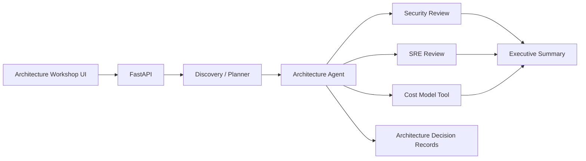

# AI Solution Architect — Agentic Architecture Workshop

A local-first architecture workshop that converts a customer problem statement into a structured proposal covering application architecture, security, SRE, implementation planning and stakeholder communication.

**Portfolio scope:** this demonstrates agent orchestration and solution-design patterns; it does not claim deployment on proprietary cloud infrastructure.

## What it demonstrates

- Multi-stage agent/workflow orchestration
- Specialized planning, architecture, security, SRE and executive-summary stages
- Local document/tool use
- Deterministic cost-model calculation
- Structured outputs and validation
- Architecture decision records (ADRs)
- Threat-model concepts: trust boundaries, data classification and least privilege
- Cloud-neutral architecture with a local/open-source execution path
- Product-style architecture workshop UI

## Architecture



## Why this is relevant to customer-facing AI engineering

A strong AI engineer is not only a prompt writer. They need to turn ambiguous requirements into explicit assumptions, system boundaries, security constraints, operational requirements and an implementation plan. This project makes those steps visible.

## Run locally

```bash
python -m venv .venv
# Windows: .venv\\Scripts\\activate
# Linux/macOS: source .venv/bin/activate
pip install -r requirements.txt
set LLM_MODE=mock
# PowerShell: $env:LLM_MODE="mock"
# Linux/macOS: export LLM_MODE=mock
uvicorn app.main:app --reload
```

Open `http://127.0.0.1:8000` and `/docs` for OpenAPI documentation.

Optional local inference can use Ollama with a compatible text model.

## Demo flow

1. Enter a customer problem and constraints.
2. Run discovery.
3. Review assumptions and architecture proposal.
4. Inspect security and SRE considerations.
5. Review the deterministic cost-model output.
6. Use the stakeholder summary as the presentation artifact.

## Evaluation / tests

```bash
python -m pytest -q
```

Useful future evaluation dimensions:

- requirements coverage
- architecture constraint adherence
- security-control completeness
- contradiction rate between sections
- cost-model consistency
- stakeholder-summary usefulness

## Design trade-offs

| Decision | Why |
|---|---|
| Explicit workflow stages | Easier to inspect and evaluate than unconstrained agent loops |
| Deterministic cost tool | Avoids fabricated numerical reasoning |
| Cloud-neutral components | Demonstrates transferable architecture knowledge without requiring a paid cloud account |
| Mock mode | Reproducible demos and CI |

## Resume bullets

- Built an **agentic solution-architecture workflow** that converts customer requirements into architecture, security, SRE, cost and executive-summary artifacts using FastAPI and structured agent stages.
- Implemented **explicit trust boundaries, least-privilege reasoning and architecture decision records** to make AI-generated solution designs reviewable by technical stakeholders.
- Added deterministic tools, automated tests, local model support and a responsive architecture-workshop UI for reproducible customer-scenario demonstrations.

## Interview questions to prepare

- How do you turn ambiguous customer requirements into testable architecture constraints?
- Why separate security and SRE review from the main architecture stage?
- How would you prevent an LLM from inventing cost figures?
- What would you move to managed cloud services in production?
- How would you validate an AI-generated architecture before presenting it to a customer?
- How would you measure adoption and business value after deployment?

## Screenshot checklist for GitHub

Add after running locally:

- `docs/images/workshop.png`
- `docs/images/architecture.png`
- `docs/images/security-sre.png`
